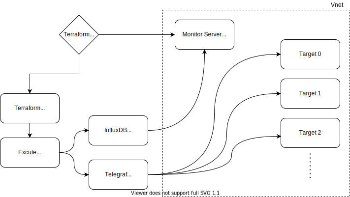

# TIG Monitoring Provision & Configuration v1
## 소개
<p>v1: 리눅스 머신(Ubuntu, CentOS) Only, 테라폼을 통한 모니터링서버 프로비젼 및 앤서블을 사용한 모니터링 서비스 및 설정 배포</p>

## Architecture


## Directory 구조
```
/
.
├── README.md
├── ansible
│   ├── install_grafana_influxdb
│   │   ├── ansible.cfg
│   │   ├── config
│   │   │   ├── grafana.ini
│   │   │   └── influxdb.conf
│   │   ├── grafana_influxdb.yml
│   │   └── inventory.ini
│   └── install_telegraf
│       ├── ansible.cfg
│       ├── config
│       │   └── telegraf.conf
│       ├── inventory.ini
│       └── telegraf.yml
├── scripts
│   ├── grafana.sh
│   ├── influx.sh
│   └── telegraf.sh
└── terraform
    ├── README.md
    ├── monitor
    │   ├── main.tf
    │   ├── output.tf
    │   ├── terraform.tfvars
    │   └── vars.tf
    └── test
        ├── main.tf
        ├── output.tf
        ├── terraform.tfstate
        ├── terraform.tfvars
        └── vars.tf
```
## Used Skills
### Terraform
Provision Monitoring Server
### Ansible
Deploy & Configure Grafana, InfluxDB to Monitoring Server<br>
Deploy & Configure Telegraf Agent to Target VMs
- Copy telegraf.conf to Target VMs

## Usage
### 1. Provision Monitoring Server
1. cd terraform
2. terraform init
3. vi terraform.tfvars
    ```
    admin_username=<USERNAME>
    admin_password=<PASSWORD>
    ```
4. terraform apply
5. output 메모(모니터서버 PIP)
### 2. Deploy Monitoring Services
#### 2-1. Deploy Grafana & InfluxDB to Monitoring Server
- ansible -m ping monitor 로 연결 확인
1. cd ansible/install_grafana_influxdb
2. vi inventory.ini
    ```
    [monitor]
    <MONITORING_SERVER_PIP>
    ```
3. ansible-playbook grafana_influxdb.yml
#### 2-2. Deploy Telegraf Agent to Target VMs 
1. cd ansible/install_telegraf
2. vi config/telegraf.conf
    ```
    ...
    [[outputs.influxdb]]
    ...
    urls = ["http://<MONITORING_SERVER_PRIVATEIP>:8086"]
    database = "<CUSTOMED_DB_NAME>"
    ...
    ```
6. vi inventory.ini
    ```
    [target]
    <TARGET_VM_PIP_01> ansible_user=<VM_USER_NAME> ansible_password=<VM_USER_PASSWORD>
    <TARGET_VM_PIP_02> ansible_user=<VM_USER_NAME> ansible_password=<VM_USER_PASSWORD>
    ...
    ```
7. ansible-playbook telegraf.yml
### To-Be
1. Ansbile -> Dynamic Inventory 사용하여 VM 아이피 정보 동적으로 가져오기
2. Windows Server 추가
3. Linux 배포판 추가
4. Target vm SSH Connection, WinRM Connection을 위한 포트 막아놓았는지 확인 하는 과정 추가
5. jinja2 Template사용해서 Config파일 템플릿화
