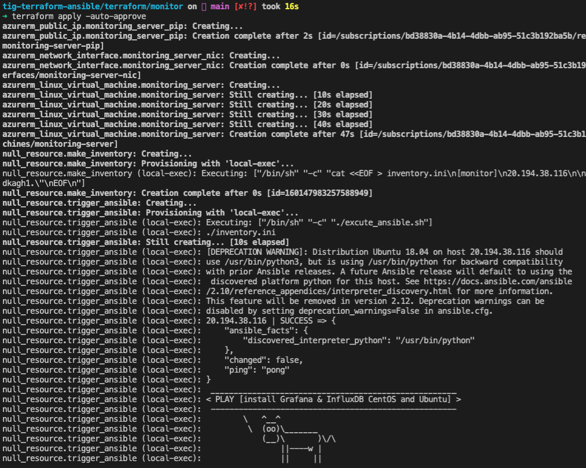
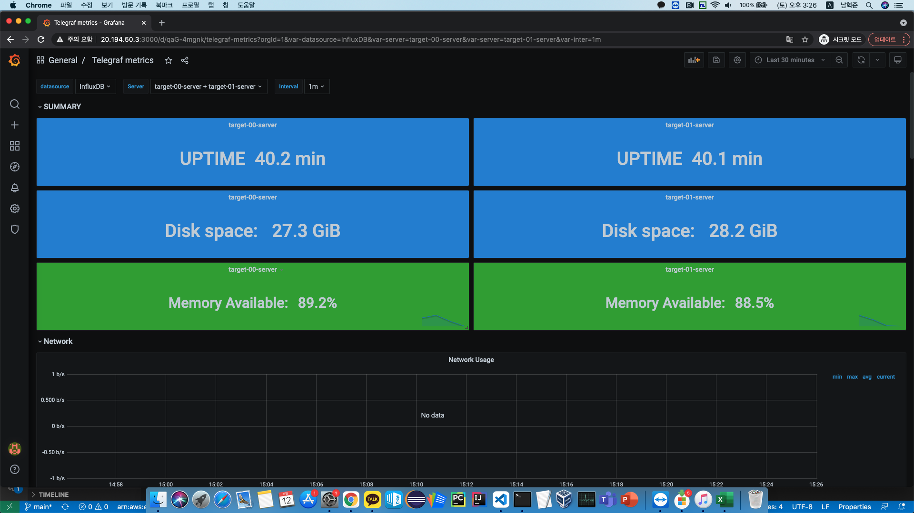
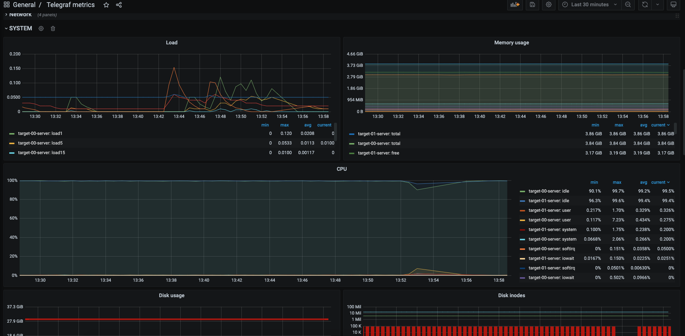

# TIG Monitoring Provision & Configuration
Installing TIG Stack by Terraform and Ansible and some shell scripts
### 개요
**Terraform & Ansible을 활용한 TIG Monitoring Service 배포 및 구성**
<p>Terraform으로 Monitoring VM을 생성힘과 동시에 Ansible playbook을 Trigger하여 Monitoring Service를 구성하고, 모니터링 대상 VM에 Agent를 배포합니다.</p>

### 데모 시나리오
```
기동중인 Production 환경에 Monitoring 서비스를 구축,
Target VM들과 Vnet,Subnet은 이미 존재하며 그 안에 TIG Monitoring 서비스를 구축
```

### Diagram


### 사전 구성
    - 데모 인프라 세팅: VNET, SUBNET, NSG, Target VM
    - ansbile/telegraf
        - inventory.ini : 타겟 VM ip 및 ansible user 정의
        - telegraf.conf : influxdb정보 세팅(db server url, db name, db user, db user password)
    - ansbile user의 sudo권한 준비
        - andible.cfg : become method 정의(become_method을 통해 ansible user는 sudo 명령을 사용)
        - inventory.ini : ansbile_user 정의
    - grafana_influxdb_ansible.yml
        - influxdb의 DATABASE, USER, PASSWORD 세팅

### Used Skill
- **Terraform 0.14.10**
- **Ansible 2.10.7**
- **Bash Shell Script**

### Work Flow
**Step 1. Provision & Configure Monitor server**
1. Enter ***terraform apply***
    - Provisioning Monitor Server(Ubuntu 18.04) (생성 후 자동으로 ansible 실행)
    - Auto Triggered Ansbile playbook<br>
        ***Ansible Tasks***
        - Deploy InfluxDB(+ Create DB and User)
        - Deploy Grafana
        - Deploy Ansible Engine(+ Copy Telegraf Workspace to Monitor server)

**Step 2. Deploy Telegraf to Target Servers** 
1. Monitor server 접속
2. telegraf Workspace - inventory 작업(타겟 private ip 및 user 등록)
3. Playbook 실행 -> Telegraf Agent 배포 완료

### 실행 화면
1. local에서 terraform apply -> 서버 프로비젼 후 ansible 자동 트리거

2. monitor server에서 ansible-playbook 실행 -> telegraf agent 배포

3. Dashboard



### 남은 미션
1. Ansible User 권한 구체화
2. Windows 추가
3. ansible-galaxy로 role 생성
4. Azure의 Dynamic Inventory사용 
5. Terraform Grafana Provider