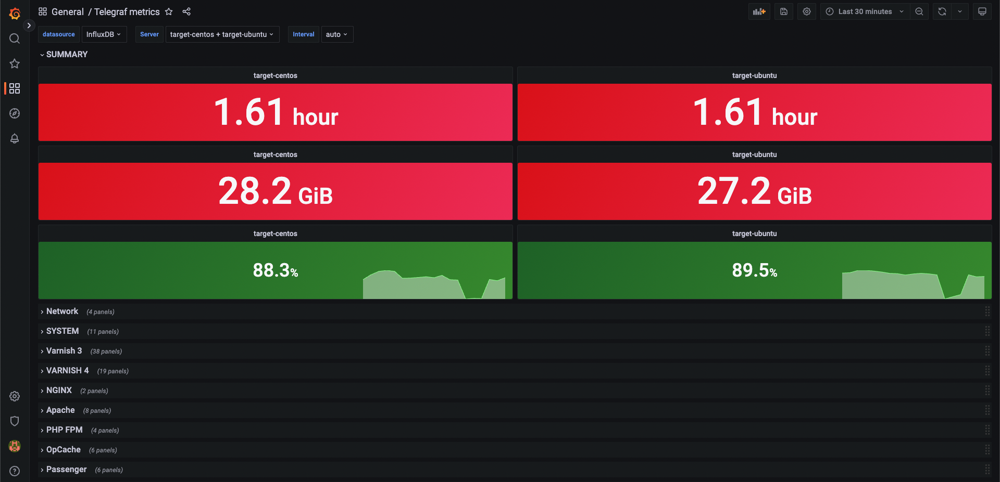

# Install TIG Stack by Packer, Terraform, Ansible
Packer를 사용해 InfluxDB, Grafana, Ansible이 설치된 Monitoring 서버 이미지를 만든 후 Terraform을 사용해 가상머신을 Provisioning 한 뒤, Ansible을 사용해 모니터링 대상 VM에 Telegraf 에이전트를 Deploy 합니다.

## Workflows
1. **Build** monitoring server image by Packer
2. **Provisioning** monitoring server vm by Terraform
3. **Deploy** telegraf agent by Ansible

## Prerequistes
1. Azure Credentials,
2. Packer >= 1.8.3
3. Terraform >= 1.3.1

## TIG Stack and Ansible Version
- Telegraf -> 1.18.1
- InfluxDB -> 1.8.10 (1.9.x Stable Version)
- Grafana -> 설치시점의 Stable Latest (2022.10 기준 v9.2.0)
- Ansible -> 설치시점의 Stable Latest (2022.10 기준 v2.9.27)

## Usage
1. Packer -> Build Image
    1. Image가 생성될 Resource Group 생성
        - 포털 혹은 cli -> ```az group create -n <RG_NAME> -l <LOCATION>```
    2. 변수파일 생성
        -  ```variables.pkrvars.hcl```
    3. 유효성 검사
        - ```packer validate -var-file=variables.pkrvars.hcl .```
    4. 이미지 생성 
        - ```packer build -var-file=variables.pkrvars.hcl .```
    5. 생성된 이미지의 ResourceID 메모
        - Output Ex) ```ManagedImageId: /subscriptions/<sensitive>/resourceGroups/packer-image-rg/providers/Microsoft.Compute/images/demo-image-05```
2. Terraform -> Provisiong VM
    - 데모용 타겟 가상머신 생성 ->  ```terraform/target_servers```
    - 모니터링 서버 -> ```terraform/monitor_server```
        1. 변수파일 생성
            - ```terraform.tfvars```
            - 이미지 리소스 id, 사용할 서브넷 정보 필요
        2. 모니터링 서버(가상머신) 생성
            - ```terraform plan & apply```
3. Ansible -> Deploy Agents
    1. 모니터링 서버 접속, 작업공간 확인
        - ```/opt/ansible```
    2. conf/telegraf.conf 수정
        - MONITOR_SERVER_IP -> 모니터링 서버 사설 IP
           -  ```  urls = ["http://MONITOR_SERVER_IP:8086"]```
    3. inventory.ini 수정
        - 관리 대상 서버들의 ```ip 주소```, ```anisble user``` 정보 입력
    4. ansible ping으로 서버 상태 체크
        - ```ansible -m ping target```
    5. ansible-playbook으로 Telegraf Agent 배포
        - ```ansible-playbook telegraf.yml```

## Results


## Release Notes
- v2.0 
    - TIG Stack by Packer, Terraform and Ansible
    - Packer -> Build Image
        1. Base Image -> Ubuntu 18.04
        2. Software -> InfluxDB, Grafana, Ansible
        3. Make ansible working directory
    - Terraform -> Provisioning Moniotoirng Server
    - Ansible -> Deploy Telegraft Agent to Target Servers
- v1.0
    - TIG Stack by Terraform and Ansible
    - Terraform -> Provisioning Monitor Server
    - Ansible -> playbook_1: Deploy InfluxDB, Grafana, Ansible to Monitor Server
    - Ansible -> playbook_2: Deploy Telegraf Agents to Nonitoring Target Servers