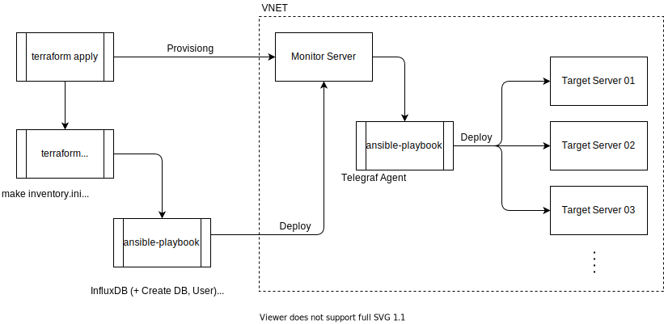
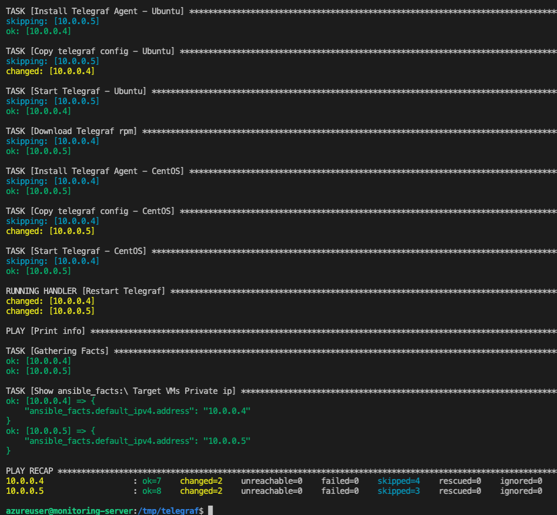

# TIG Monitoring Provision & Configuration
### 소개
***terraform apply 한번으로 TIG Monitoring Service 배포 및 구성까지***
<p>Terraform으로 Monitor Server를 생성힘과 동시에 Ansible playbook을 Trigger하여 Monitoring Service를 구성하고 Agent를 배포합니다.</p>

***전제조건***
```
운영중인 Production 환경에 Monitoring서비스를 구축하는 시나리오로 가정,
따라서 Target Server들과 Vnet,Subnet은 이미 존재하며 그 안에 monitor server를 생성하는 시나리오
```
### Diagram


### Skill Stack
- ***Terraform 0.14.10***
- ***Ansible 2.10.7***
- ***Bash Shell Script***
### Working Flow
**Step 1. Provision & Configure Monitor server**
1. Enter ***terraform apply***
    - Provisioning Monitor Server(Ubuntu 18.04) (생성 후 자동으로 ansible 실행)
    - Auto Triggered Ansbile playbook<br>
        ***Ansible Tasks***
        - Deploy InfluxDB(+ Create DB and User)
        - Deploy Grafana
        - Deploy Ansible Engine(+ Copy Telegraf Workspace to Monitor server)

**Step 2. Deploy Telegraf to Target Servers** 
1. Monitor server 접속
2. telegraf Workspace - inventory 작업(타겟 private ip 및 user 등록)
3. Playbook 실행 -> Telegraf Agent 배포 완료

### 실행 화면
1. local에서 terraform apply -> 서버 프로비젼 후 ansible 자동 트리거

2. monitor server에서 ansible-playbook 실행 -> telegraf agent 배포

3. Dashboard


### To-Be
1. 기존 운영 중인 서버들에 Ansible User의 root권한 확보방식 구체화
2. 타겟 OS 추가(Windows, Debian, SUSE)
3. ansible-galaxy로 role생성하여 task세분화 -> jinja2 template으로 config파일 템플릿화
4. telegraf배포시 ansible Dynamic Inventory사용
5. Terraform Grafana Provider 사용해서 구성해보기