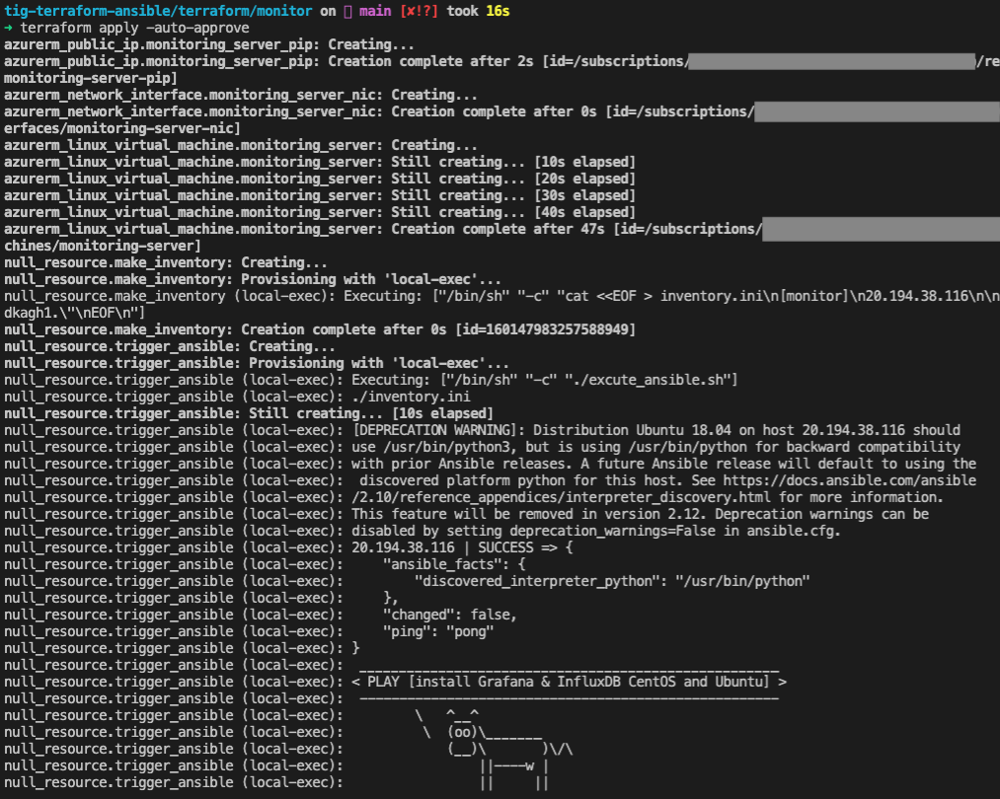

# TIG Monitoring Provision & Configuration
Installing TIG Stack by Terraform and Ansible and some shell scripts
### 개요
Terraform & Ansible을 활용한 TIG Monitoring Service 배포 및 구성

Terraform으로 Monitoring VM을 생성힘과 동시에 Ansible playbook을 Trigger하여 Monitoring Service를 구성하고, 모니터링 대상 VM에 Telegraf Agent를 배포합니다.

### Prerequisites
- Terraform > 0.14.10
- Ansible > 2.10.7
- Bash

### 데모 시나리오
Production 환경에 Monitoring 서비스를 구축 합니다. 즉, Target VM들과 Vnet,Subnet은 이미 존재하며 동일한 환경에 TIG Monitoring 서비스를 구축합니다.

### Diagram

### Work Flow
**Step 1. Provision & Configure Monitor server**
1. Enter ***terraform apply***
    - Provisioning Monitor Server(Ubuntu 18.04) (생성 후 자동으로 ansible 실행)
    - Auto Triggered Ansbile playbook 
        ***Ansible Tasks***
        - Deploy InfluxDB(+ Create DB and User)
        - Deploy Grafana
        - Deploy Ansible Engine(+ Copy Telegraf Workspace to Monitor server)

**Step 2. Deploy Telegraf to Target Servers** 
1. Monitor server 접속
2. telegraf Workspace - inventory 작업(타겟 private ip 및 user 등록)
3. Playbook 실행 -> Telegraf Agent 배포 완료

### 실행 화면
1. local에서 terraform apply -> 서버 프로비젼 후 ansible 자동 트리거

2. monitor server에서 ansible-playbook 실행 -> telegraf agent 배포

3. Dashboard

