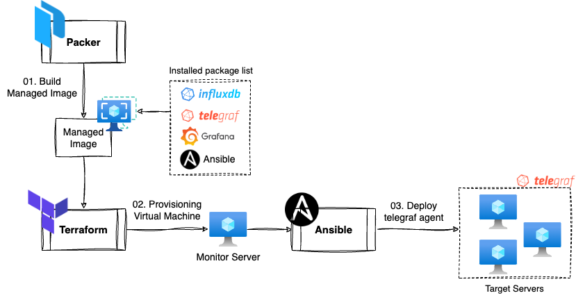

# Install TIG Stack by Packer, Terraform, Ansible

Provisiong TIG Stack by Packer, Terraform. Ansible  

**Build** VM Image by Packer,  
**Provisioning** VM by Terraform,  
**Deploy** telegraf agent by Ansible

# Evironment
### Infra
- Azure Cloud

### Virtual Machine (Monitor Server) Spec
- SKU: Standard_DS2_v2 (2 vCPU, 7 GiB Mem)
- OSL Linux
- Distro: Ubuntu 20.04 (Azure Image URN: Canonical:0001-com-ubuntu-server-focal:20_04-lts-gen2:20.04.202307010)

### Tool
- Packer > v1.9.1
- Terraform > v1.4.6
- Ansible stable latest
- Shell Script (Bash)

### Softwares
- influxdb v1.8.10
- telegraf v1.27.1
- grafana stable latest
- ansilbe stable latest

# Usage
## Prerequire
- Azure Account
- macOS or WSL2 Terminal, VSCode
- packer, terraform in Local PC

## Step
1. [Packer](packer) build monitoring vm image
2. [Terraform](terraform) provisioning virtual machine
3. [Ansible](ansible) deploy telegraf

# Result
### Grafana Dashboard (import 928)

# Release Notes
- v3.0
    - Simplify steps
        1. packer build
        2. terraform provisiong
        3. ansible deploy
    - Use shell script
        - packer (install software(influxdb, telegraf, grafana, ansible))
        - terraform: custom data (edit telegraf conf)
    - Update software version
        - InfluxdB v1.8.10
        - Telegraf v1.27.1
- v2.0 
    - TIG Stack by Packer, Terraform and Ansible
    - Packer -> Build Image
        1. Base Image -> Ubuntu 18.04
        2. Software -> InfluxDB, Grafana, Ansible
        3. Make ansible working directory
    - Terraform -> Provisioning Moniotoirng Server
    - Ansible -> Deploy Telegraft Agent to Target Servers
- v1.0
    - TIG Stack by Terraform and Ansible
    - Terraform -> Provisioning Monitor Server
    - Ansible -> playbook_1: Deploy InfluxDB, Grafana, Ansible to Monitor Server
    - Ansible -> playbook_2: Deploy Telegraf Agents to Nonitoring Target Servers