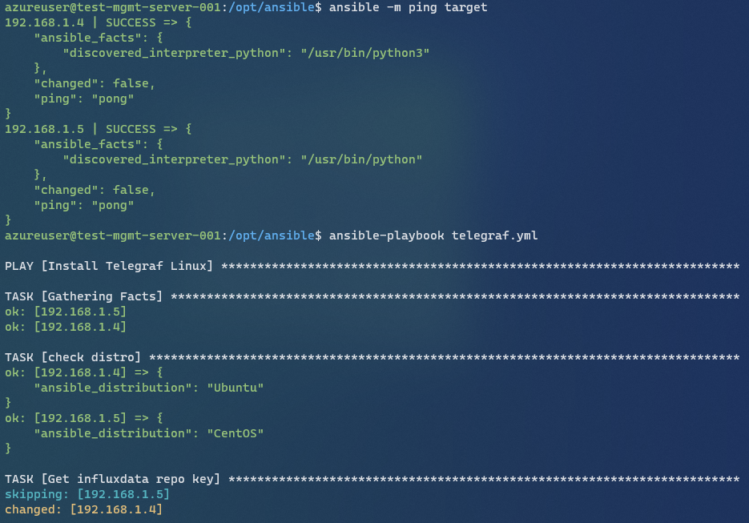

# Ansible
Install telegraf agent to target servers

# Usage
## Prerequire

- **Target Server's Private IP**

    모니터링 대상 서버들의 사설 IP가 필요합니다. OS 및 배포판에 따라 앤서블 인벤토리에 입력할때 사용합니다.

## Step
1. Edit inventory.ini
    ```
    # ubuntu, centos
    [target]
    # Ubuntu
    <UBUBTU_PRIVATE_IP> ansible_user="" ansible_password=""

    # CentOS
    <CENTOS_PRIVATE_IP> ansible_user="" ansible_password=""  ansible_become_password=""
    ```

2. Check target servers
    ```
    ansible -m ping target
    ```

3. Run ansible-playbook
    ```
    ansible-playbook telegraf.yml
    ```
# Info
- 타겟 서버들의 OS는 Linux, 배포판은 Ubuntu 또는 CentOS 만 가능합니다.
- telegraf.yml에서 block-when 절로 확인 할 수 있습니다.
- 만약, 커스텀 구성 중 telegraf 재시작이 필요한 경우 notify 구성하여 이미 있는 handler 사용하시면 됩니다.

# Result
