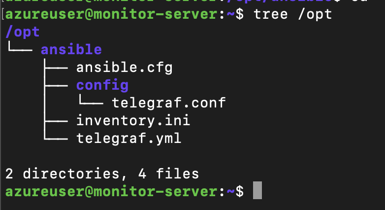
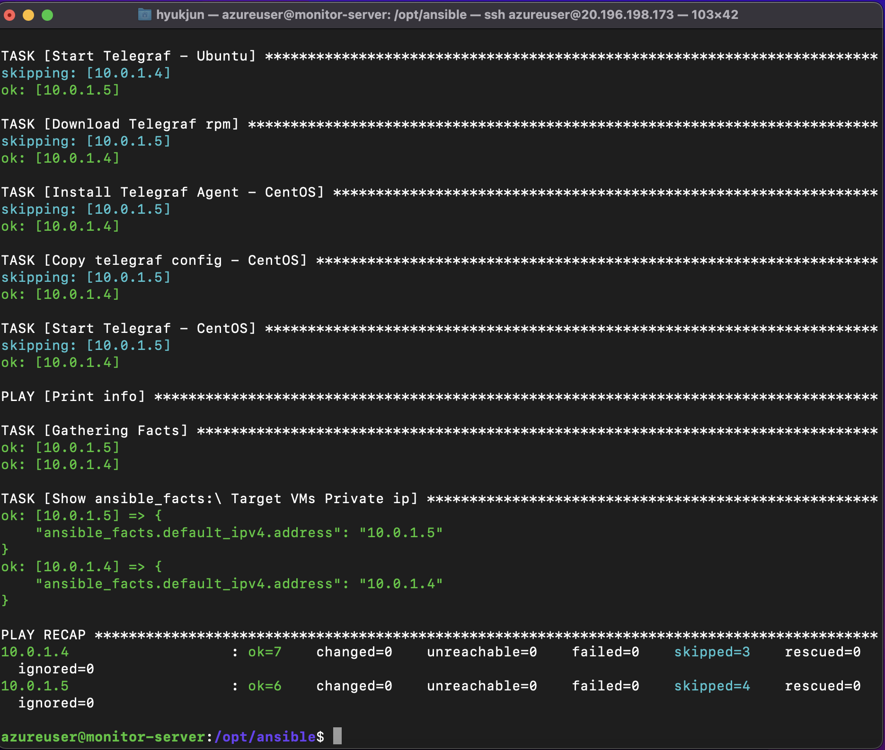

# Deploy Telegraf Agent
모니터링 대상 서버에 Telegraf Agents 배포
- Target OS: Ubuntu, CentOS
- Telegraf v1.18.1
- inventory.ini 작성 필요
- conf/telegraf.conf에 모니터링 서버의 사설 IP 입력 필요
- vi/vim YAML 작업 팁 -> .vimrc 세팅

### telegraf.yml
- Telegraf v1.8.1 설치
- when 절로 OS 구분

### 작업 공간
- /opt/ansible

    
- playbook 실행 후

    