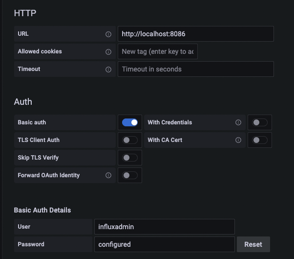
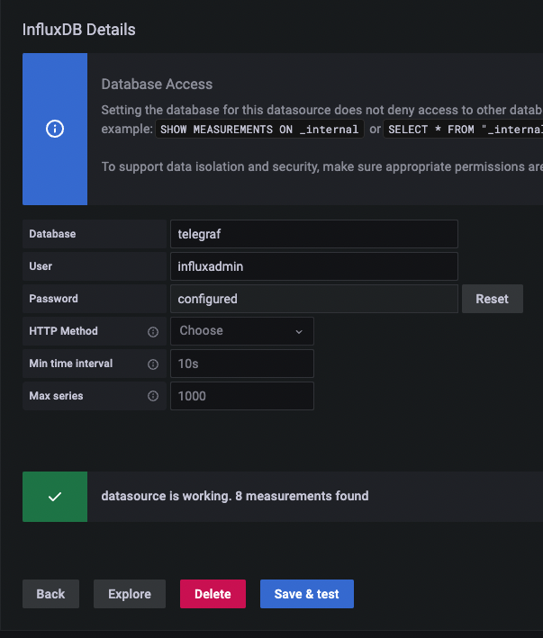

# Provisioning Mointor Server (VM)
모니터링 서버 생성

### main.tf
- data "azurerm_subnet" "monitor" {}
    - 모니터링 서버가 사용할 서브넷은 미리 생성되어 있는 서브넷을 사용합니다.
    - 해당 서브넷을 data block으로 가져오며, vnet,subnet,resource group의 정보가 필요합니다.(변수입력)
- 모니터링 서버는 별도의 리소스그룹을 생성하여 사용합니다.
- vm의 source image id는 packer로 생성한 image id 입니다.

### Grafana Setup
- Data Source

    
    
    
- Dashboard
    - import 61